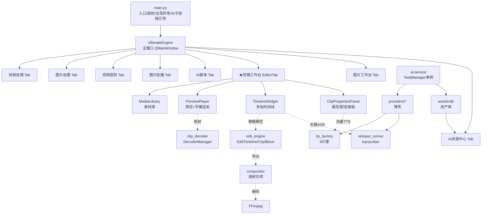
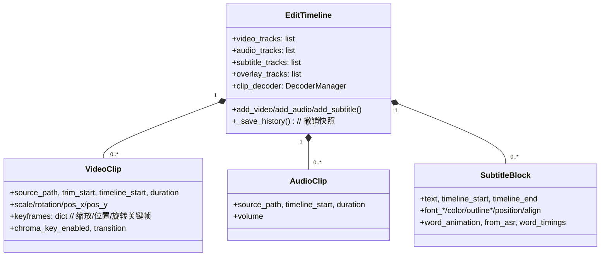

# CreativeEnginePro —— 项目架构与实现说明（中文版）

> 本文档为自包含的技术说明，供接手开发 / 借助 AI（ChatGPT 等）协助排障与扩展时快速建立全局认知。
> 所有类名、模块路径均来自当前代码库（截至 2026-07），可据此直接定位源码。

---

## 0. 一句话定位

**CreativeEnginePro**（内部曾用名「小欢ovo 信息流批量剪辑工具」）是一个基于 **PyQt6 的桌面端视频剪辑工具**，面向短视频 / 带货 / 短剧的信息流生产场景。它把「导入素材 → 多轨剪辑 → 配音(TTS) / 语音识别(ASR) / 人声分离 → AI 资源管理与脚本 → 批量导出」整合成一个离线可运行的桌面程序，并内置打包脚本可直接产出单文件 exe。

核心卖点：多时间线、多轨（视频 / 音频 / 字幕 / 叠加）、逐帧合成导出、6 种 TTS 引擎批量配音落轨、Whisper 语音识别转字幕、人声分离、混剪矩阵去重、AI 资源中心（人物/场景/Prompt 一致性资产库）。

---

## 1. 技术栈

| 层面 | 技术 |
|------|------|
| GUI | Python 3.13 + **PyQt6**（QMainWindow / QWidget / QTabWidget / QStackedWidget / 自定义 Canvas 绘制） |
| 视频解码 | **OpenCV (cv2.VideoCapture)** 帧级解码，封装为状态机解码器 |
| 视频编码 | **FFmpeg / FFprobe**（项目自带 `ffmpeg.exe`；FFprobe 缺失时回退 ffmpeg 解析） |
| 辅助渲染 | MoviePy（部分路径）、QtMultimedia（音频播放 / 视频帧 sink） |
| AI · 语音识别 | **Whisper**（独立子进程运行，绕开 torch DLL 冲突） |
| AI · 人声分离 | Spleeter > Demucs > FFmpeg 纯滤波（依次回退） |
| AI · TTS 配音 | Edge-TTS（免费）/ FishAudio（声音克隆）/ ElevenLabs / SiliconFlow / Deepgram / Auto-Lang，共 6 引擎 |
| AI · 超分 / 抠图 | onnxruntime + Real-ESRGAN / BiRefNet / CodeFormer（**子进程隔离**加载，避免与主进程 PyQt/cv2 的 DLL 冲突） |
| 存储 | **SQLite**（AI 任务历史、资源中心资产库、自动保存草稿）、**JSON**（`.cep` 工程文件、credits 署名表） |
| 打包 | **PyInstaller** 单文件，`ffmpeg.exe` 内嵌进 `_MEIPASS`，`CreativeEnginePro.spec` + `一键打包.bat` |
| 授权 | 代码内 `datetime(2026,10,1)` 到期检查（仅弹窗提示，非强校验） |

**分层原则**：`core/` 与 `ai/` 为纯逻辑层，**不直接依赖 PyQt**（仅通过注入的 Qt 信号 / 回调与 UI 通信）；UI 层（`ui/`）负责所有界面与交互。

---

## 2. 目录结构（精简树）

```
CreativeEnginePro/
├── main.py                      # 入口：授权、全局异常、AI 子进程 worker 引导、启动 UltimateEngine
├── api_config.py                # ★ 统一 API 容器（Single Source of Truth）：产品全部外部 API 集中声明
├── config.py                    # 全局配置：FFMPEG_BIN/FFPROBE_BIN；API 常量由 api_config 导出（向后兼容）
├── CreativeEnginePro.spec       # PyInstaller 打包定义（含 rembg/onnxruntime 特殊处理）
├── ffmpeg.exe                   # 内嵌 FFmpeg 二进制
├── ui/                         # 全部界面与交互（PyQt6）
│   ├── main_window.py           # UltimateEngine 主窗口 + 视频/图片/混剪/轮播模块（mixin）
│   ├── editor_tab.py           # ★剪辑工作台（核心 Tab）：多时间线 + 素材库 + 预览 + 时间线 + 属性/配音
│   ├── timeline_widget.py       # TimelineWidget / TimelineCanvas：多轨时间线、拖拽、播放时钟、右键菜单
│   ├── preview_player.py        # PreviewPlayer：OpenCV 帧预览 + 字幕渲染 + 画布交互
│   ├── clip_properties.py       # ClipPropertiesPanel：属性 / 配音 双 Tab 容器
│   ├── dubbing_panel.py         # DubbingPanel：批量 TTS 配音并落轨
│   ├── voice_picker.py          # VoiceSelectButton：声音选择 + 试听 + 缓存
│   ├── media_library.py          # MediaLibrary：素材库（导入/预览/拖入时间线）
│   ├── script_workbench.py       # AI 脚本工作台
│   ├── video_workbench.py        # 视频工作台（字幕识别等）
│   ├── image_editor.py           # 图片工作台：图层编辑
│   ├── image_handler.py / mix_handler.py / slideshow_handler.py / image_editor_handler.py  # 主窗口 mixin
│   ├── download_panel.py / scrape_panel.py / settings_panel.py / export_dialogs.py / batch_workspace.py ...
├── core/                       # 核心引擎（纯逻辑，尽量无 PyQt 依赖）
│   ├── edit_engine.py          # ★数据模型：VideoClip / AudioClip / SubtitleBlock / TrackInfo / EditTimeline + 导出 Worker
│   ├── compositor.py           # VideoCompositor：逐帧合成（多轨 PiP + 字幕渲染 + 绿幕/alpha）
│   ├── clip_decoder.py         # DecoderManager / ClipDecoder：状态机解码器 + RingBuffer 缓存
│   ├── tts_factory.py / tts_edge.py / tts_fish.py / tts_eleven*.py(tts_engine) / tts_siliconflow.py / tts_deepgram.py / tts_auto_lang.py  # 6 个 TTS 引擎 + 工厂
│   ├── whisper_runner.py / transcriber.py   # ASR（子进程 + SRT 工具）
│   ├── separator.py / demucs_runner.py / mdx_separator.py  # 人声分离
│   ├── script_gen.py           # AI 脚本生成
│   ├── mixer.py / mix_engine.py / dedup.py / pipeline.py   # 混剪 / 去重 / 流水线
│   ├── video_engine.py         # VideoProcessor：尾页断点分析 + 极速/全量导出
│   ├── slideshow_engine.py     # 图片轮播转视频（14 种转场）
│   ├── downloader.py / openverse_api.py / asset_pipeline.py / time_sync.py / builtin_translator.py / mdx_separator.py ...
├── ai/                        # AI 能力层（调度 + Provider 薄壳 + 资产库）
│   ├── service.py              # 单例入口：get_ai_manager() / get_asset_db()
│   ├── task_manager.py         # TaskManager：任务调度、并发分池、重试、SQLite 历史
│   ├── providers/              # base + voice/llm/image/video 四类 Provider（薄壳，实际调 core/）
│   ├── assets/db.py            # AssetDB：人物/场景/Prompt/声音预设 四类资产 CRUD
│   ├── workflows/base.py       # BaseWorkflow：多步 AI 任务编排基类
│   └── ui/resource_center.py   # AI 资源中心界面（三栏 IDE 布局）
├── utils/                     # 基础工具
│   ├── ffmpeg_utils.py         # 打包/开发环境 FFmpeg 路径统一
│   ├── chroma_key.py          # 绿幕抠像（LUT 优化 + 缓存，预览=导出）
│   ├── alpha_video.py         # Alpha 视频解码（保留 BGRA 透明通道）
│   ├── mask.py / logger.py
├── tools/tribeofnoise_cc_downloader.py   # 合规 CC 授权音乐下载器（独立 CLI）
└── Cache/ work_temp/ work_output/         # 运行时缓存与产物目录
```

---

## 2.1 统一 API 容器（api_config.py）

> 所有外部 API 的**单一来源**：LLM / TTS 语音 / 图像生成 / 视频生成 / 音乐素材 / 热点数据。
> 以后要切换或新增 API，**只改这一个文件**。

- 每个 API 用 `APIEntry` 声明：`env_key`（.env 变量名，向后兼容）、`default_base_url`、`default_model`、`label`、`notes`、`category`。
- `config.py` 在加载时遍历 `ALL_APIS`，把全部纯 env 常量（`OPENAI_API_KEY`、`ELEVENLABS_API_KEY`、`FISH_AUDIO_KEY`、`SILICONFLOW_KEY`、`DEEPGRAM_KEY`、`YOUTUBE_KEY`、`TMDB_KEY`、`NEWSAPI_KEY`、`TRENDMCP_KEY`、`CUSTOM_LLM_*` …）导出为模块级常量，**其余代码 `from config import X` 无需改动**即可继续工作。
- `.env` 读写统一走 `api_config.write_env()/read_env()`（配音面板的引擎 Key 保存、以及「设置中心」偏好页都已收口到这里）。
- **「设置中心」面板**（`ui/settings_panel.py`，主窗口左侧「⚙ 设置」按钮打开）：当前为**单一「偏好」页**（API 总览页已移除，因为产品只用 DeepSeek，无需逐条展示已配/未配）。
  - **LLM 配置**：`LLM_MODE`（默认 `deepseek`，可选 `openai` / `custom_llm`）+ 模型名 + `API Key`（统一写入 `LLM_API_KEY`）+ `Base URL`（留空用官方地址；DeepSeek 默认 `https://api.deepseek.com/v1`）。保存写回 `.env` 并同步 `config`（切换后建议重启以完全生效）。OpenAI / 自定义仅作为可切换选项，纯 DeepSeek 用户无需填。
  - **性能与缓存**：解码缓冲帧数 `DECODER_BUFFER`（4–120，默认 24）、缩略图宽度 `THUMB_SIZE`（80–640，默认 320）、缓存自动清理（**显式开关** + 阈值 `CACHE_MAX_GB` 0–50GB，关/0 = 不清理；打开面板实时显示当前 `Cache/`+`work_temp/` 真实占用，启动时按阈值删最旧文件）。
- 新增 `config` 性能/缓存项：`DECODER_BUFFER`（解码器 RingBuffer 窗口，默认 24）、`THUMB_SIZE`（素材库缩略图宽度，默认 320）、`CACHE_MAX_GB`（缓存清理阈值，默认 0）。`core/clip_decoder.py` 的 `RingBuffer` 与 `ui/media_library.py` 的 `_make_thumbnail` 已接入这两项。LLM 派生配置改进：支持 `openai` 模式与 `LLM_BASE_URL` 覆盖（deepseek 默认走 `https://api.deepseek.com/v1`）。
- 便捷方法：`get(name)`、`value(name)`、`by_category(cat)`、`all_entries()`、`summary()`（命令行 `python api_config.py` 打印全部清单）。

**典型管理操作**
- 把 DeepSeek 换 ChatGPT：在「设置中心 → 偏好」把 `LLM_MODE` 设为 `openai` 并填 `OPENAI_API_KEY`（OpenAI 模式专用），或选 `custom_llm` 填自己的端点。纯 DeepSeek 维持默认即可，`LLM_API_KEY` 装 DeepSeek key。
- 加一个新的图片/视频模型 API：在 `api_config.py` 对应 `CATEGORY` 列表里加一条 `APIEntry`，配置层（`config.py` 自动导出常量）与读写层自动识别；UI 若需展示再加一行。

---

## 3. 整体架构（分层图）



**关键设计决策**
- UI 与逻辑解耦：引擎层可被测试、被 CLI（`core/pipeline.py`）复用，不绑定 Qt。
- `ai.providers.*` 是**薄壳**：真实实现全部在 `core/`（如 `EdgeTTSProvider`→`core.tts_edge`，`WhisperProvider`→`core.transcriber`，`FishAudioProvider`→`core.tts_fish`）。新增模型只需在 core 实现 + provider 包一层。
- **AI 推理子进程隔离**：主进程已加载 PyQt6/cv2，直接 import onnxruntime 会因原生 DLL 冲突初始化失败。`main.py` 通过 `--realesr-worker` / `--ai-worker` 参数重启一个干净子进程专跑推理，主进程只做 cv2 预处理，结果经 `.npy` 文件回传。

---

## 4. 主窗口 UI 排列（UltimateEngine）

主窗口 = 左侧固定宽度（150px）**Sidebar 导航** + 右侧 `QStackedWidget`（8 个 Tab）。默认打开**剪辑工作台**（index=5）。

### 4.1 左侧导航
- 顶部 Logo「小欢 ovo」
- 常驻按钮（独立高亮色条）：`✂ 剪辑工作台`(青色) / `🎨 图片工作台`(紫色) / `🤖 AI 资源中心`(蓝色)
- 折叠分组 `视频部分`：尾页处理(0) / 视频混剪(2) / 图片轮播(3)
- 折叠分组 `图片部分`：图片处理(1)
- 折叠分组 `AI部分`：AI脚本(4)
- 底部 `⚙ 设置`（打开「设置中心」偏好页）/ `🧹 清理缓存`

### 4.2 八个 Tab 一览
| idx | 名称 | 主要内容 | 关键模块 |
|-----|------|----------|----------|
| 0 | 视频处理 | 视频队列表 + 单条精修预览 + 尾页断点分析 + 批量导出 | `core.video_engine.VideoProcessor` |
| 1 | 图片处理 | 图片批量滤镜/尺寸处理 | `ui.image_handler` |
| 2 | 视频混剪 | 矩阵混剪 + 去重 + BGM/配音混合 | `core.mixer` / `core.mix_engine` / `core.dedup` |
| 3 | 图片轮播 | 多图转轮播视频（14 种转场） | `core.slideshow_engine` |
| 4 | AI脚本 | 爆款脚本生成 + 翻译/润色 | `core.script_gen` + `ai.*` |
| **5** | **★剪辑工作台** | **多轨剪辑核心（见第 5 节）** | `ui.editor_tab` |
| 6 | 图片工作台 | 图层编辑（透明通道、加点、文字） | `ui.image_editor` |
| 7 | AI资源中心 | 人物/场景/Prompt 资产库（三栏 IDE） | `ai.ui.resource_center` |

---

## 5. 剪辑工作台详解（核心）

`EditorTab` 是产品最核心的工作台，承载多轨剪辑全流程。

### 5.1 布局（三段式 + 时间线）

```
┌─────────────────────────── 顶部工具栏 ───────────────────────────┐
│ 工程名(可双击改)   💾保存 📂打开   画布比例 ▾   📝字幕   导出 │
├────────── AI 进度条（默认隐藏）────────── AI 状态标签 ───────────┤
├──── _top_splitter (横向) ───────────────────────────────────────┤
│ 左: QTabWidget        │ 中: PreviewPlayer      │ 右: ClipProperties │
│  📁素材库             │  (OpenCV 帧预览         │  (滚动区)           │
│  📥下载              │   + 字幕/画布交互)       │  ┌ 属性 Tab ──────┐ │
│  📡扒取              │                         │  │ 视频/音频/字幕 │ │
│                      │                         │  ├ 配音 Tab ──────┤ │
│                      │                         │  │ 批量TTS配音    │ │
├──── _main_splitter (纵向) ───────────────────────────────────────┤
│ _tl_tab_bar  (多时间线切换标签栏，可拖拽排序)                      │
│ _tl_stack    (TimelineWidget：多轨时间线 + 播放头 + 缩放)          │
└──────────────────────────────────────────────────────────────────┘
```

- **左栏** `MediaLibrary` / `DownloadPanel` / `ScrapePanel` 以 Tab 组织；素材库支持拖拽/点击把素材送入时间线。
- **中栏** `PreviewPlayer` 用 OpenCV 取帧（`cv2.VideoCapture`）→ QImage → 自定义绘制；支持缩放、旋转、位置拖拽、字幕实时渲染。
- **右栏** `ClipPropertiesPanel` 是 `QTabWidget`：`属性` Tab（选中片段的参数：裁剪/变换/关键帧/字幕同步/转场）与 `配音` Tab（选中字幕片段时出现，批量 TTS 落轨）。
- **底部** 多时间线：每条时间线是一个 `TimelineWidget`，通过 `_tl_tab_bar` 切换；支持多时间线并行工程。

### 5.2 数据模型（core/edit_engine.py）



- **多轨**：视频轨、音频轨、字幕轨、叠加轨（画中画/绿幕层）各自独立列表；导出时由合成器统一叠加。
- **关键帧**：`keyframes = {"scale":[(t,v),...], "pos_x":[...], ...}`，`interpolate_keyframes()` 线性插值；时间单位为相对片段起点的秒。
- **撤销模型（已踩坑后定型）**：`_save_history()` 保存的是「该次操作之前」的状态（pre-state）。`undo()` 恢复 `history[index]`（上一步之后状态），`redo()` 恢复 `history[index+1]`。首次撤销时把「当前实时状态」补入历史末端，使 redo 能一路回到最新。每次关键操作（拖拽 >2px 才入栈，用 `_drag_modified` 门控；分割/删除/拖拽组合操作传 `save_history=False` 防止重复入栈）。
- **缩略图不变式**（用户确认）：旧图保留到新图就绪、缓存 key = `VideoID+FrameList`（不含 Zoom）、缩放只重排 Layout 不触发 FFmpeg 重抽帧；`VideoClip.__deepcopy__` 必须按引用保留 `thumbnails`，否则撤销丢图。

### 5.3 时间线交互（ui/timeline_widget.py）

- `TimelineWidget` / `TimelineCanvas`：多轨绘制、片段拖拽、播放头、时间缩放（滚轮）、吸附（`_snap_sec` 阈值 cap 0.15s）。
- **播放时钟**：`_tick_play` → `master_clock_sec()`（**锁 slot0 音频时钟**，曾因遍历所有 audio slot 导致切换时跳变）→ `set_playhead` → `preview.seek`。音频用 `QMediaPlayer`(ffplay 子进程封装) 的 `audio_clock_sec`。
- **右键菜单**（按片段类型动态）：
  - 视频：`🎵 分离人声` / `📝 语音识别` / `📸 定格帧(3s)` / `🖼 提取当前帧到图层` / `🔄 倒放`
  - 字幕：`✏ 编辑文本` / `✨ AI 润色`（叠加在原字幕上方，带进度条）
  - **音频**：`📝 语音识别`（把音频转成字幕轨，见 5.5）
  - 多选字幕：`▶ 朗读选中字幕 (N)`（直接播放，不落轨）

### 5.4 预览与合成（预览=导出一致性）

- `PreviewPlayer`（`ui/preview_player.py`）：OpenCV 逐帧取图 → 叠加字幕/变换 → 画布交互。`DecoderManager` 把 `source_path → ClipDecoder` 一对一映射，同文件多轨道各自独立解码器（避免共享 `VideoCapture` 位置错位）。
- `VideoCompositor`（`core/compositor.py`）：导出时从 `EditTimeline` 逐帧合成——多轨 PiP 叠加（位置/缩放/旋转 + 关键帧插值）、完整字幕样式渲染、绿幕/alpha 通道处理。导出路由 `FFmpegDirectExportWorker._needs_compositor()` 检测绿幕/alpha/转场 → 强制走逐帧渲染，避免 `filter_complex` 丢透明通道。
- **绿幕延迟模式**：非绿幕片段先按轨序绘制，绿幕片段收集后统一在最顶层绘制，保证透明区露出下层。

### 5.5 配音（TTS）与语音识别（ASR）

**批量配音落轨**（用户高频使用）：
1. 在时间线多选字幕片段（或选中单条）→ 右侧 `配音` Tab 选引擎/声音/语速/音量。
2. `DubbingPanel._generate()` 收集所有选中字幕（经 `get_subtitles_cb` 回调，解决「只生成第一段」问题）→ 构建 `_gen_queue`（每条字幕一段）。
3. 顺序生成：每个 worker 用 `TTSGenerationWorker` 合成 → 落轨回调 `_dubbing_add_audio(path, dur, timeline_start, subtitle_end)` 把音频加到**非冲突音频轨**（不再截断到字幕段、不再进素材库）。
4. **worker 生命周期**：每个 QThread 只 `deleteLater()` 一次（曾因「还有下一条」分支重复 delete 导致闪退，已改为 `_safe_delete_worker()` 统一回收）。

**语音识别转字幕**：
1. 右键视频/音频片段 → `📝 语音识别`。
2. `editor_tab._do_asr_clip`：视频优先用分离后人声 `_vocals_path`，音频直接用自身 mp3；偏移量 = `clip.timeline_start - clip.trim_start`。
3. `whisper_runner.run_whisper_asr()` 在**独立子进程**运行 Whisper → 返回带时间戳的 SRT 条目。
4. 时间戳 + offset 映射到时间线 → 自动同步到字幕轨（`_sync_subs_to_timeline`），并打开字幕管理弹窗。
5. **叠加不清除**：`_on_asr_done` 会先收集轨道上现有字幕（含样式）合并进同步列表，再重建，因此**保留旧字幕、仅叠加新识别内容**（避免之前「一识别就把原字幕全清掉」的问题）。

### 5.6 导出

`edit_engine.py` 三个导出 Worker：
- `FFmpegExportWorker`：纯 FFmpeg 拼接/滤镜（极速，无逐帧）。
- `MoviePyExportWorker`：MoviePy 全量渲染。
- `FFmpegDirectExportWorker`：需逐帧合成（绿幕/alpha/转场）时走 `VideoCompositor` 渲染后再编码。

导出对话框（`ui/export_dialogs.py`）收集分辨率、码率、格式等，经 `edit_engine` 序列化与进度回传。

### 5.7 工程与自动保存

- 工程文件 `.cep`（JSON）：序列化所有时间线、画布比例、素材库路径、窗口布局。
- **自动保存**：`EditorTab` 用防抖定时器（`AUTOSAVE_DEBOUNCE_MS`）+ 兜底周期定时器；启动时 `_maybe_restore_autosave()` 检测并提示恢复草稿（崩溃保护）。
- AI 任务、资源中心资产均落 SQLite（`~/.cep_data/`）。

---

## 6. AI 能力层（ai/）

### 6.1 调度架构
- `ai.service.get_ai_manager()` 返回**全局唯一** `TaskManager`（双检锁单例），按配置懒注册 Provider：
  - `EdgeTTSProvider` 永远可用（免费）；
  - OpenAI/DeepSeek 仅在 `.env` 配 `LLM_API_KEY` 时注册；
  - FishAudio 仅在配 `FISH_AUDIO_KEY` 时注册。
- `TaskManager`：优先级队列 + 并发分池（API 3 线程 / 本地 1 线程）、指数退避重试、结果缓存（`TaskCache`）、SQLite 历史（`TaskHistoryDB`）、Qt 信号桥（`AITaskSignals`，UI 注入 QObject 子类接收进度/完成）。
- `AssetDB`（`ai/assets/db.py`）：人物一致性 / 场景 / Prompt 模板 / 声音预设 四类资产的 CRUD（SQLite）。`PromptTemplate.render()` 支持 `{var}` 参数填充。

### 6.2 Provider 体系
`ai/providers/` 分 `voice` / `llm` / `image` / `video` 四域，均继承 `providers/base.py` 的 `AIProvider` 抽象类，经 `ProviderRegistry` 注册与查询。**真实能力在 `core/`**（见 5.5 / 第 1 节）。

- **Seedream 5.0 Pro（图片）已接入**：`providers/image/seedream.py` 调 Ark `POST /images/generations`，支持 `text_to_image` / `image_edit`。
- **GPT-Image-2（图片）已接入**：`providers/image/seedream.py` 的 `GPTImageProvider` 调 OpenAI 兼容 `POST /images/generations`，支持 `text_to_image` / `image_edit`。
- **Seedance 2.0（视频）已接入**：`providers/video/veo.py` 根据 Key 类型自动选择火山方舟或 ModelHub 豆包兼容 API，支持 `text_to_video` / `image_to_video`。
- **Veo 3.1（视频）已接入**：`providers/video/veo.py` 的 `VeoProvider` 调 ModelHub `POST /videos/generations` 提交 + 轮询 + 下载，支持 `text_to_video` / `image_to_video`。
- Ark 调用共用 `SEEDREAM_API_KEY`；OpenAI 系列（LLM / GPT-Image / 后续 Veo）复用 `OPENAI_API_KEY`。

### 6.3 AI 资源中心 UI
`ai.ui.resource_center.ResourceCenterTab`：三栏 IDE 布局——左 `SidebarNav`（类别导航+标签树+平台过滤）、中 `MainCanvas`（缩略图网格/Prompt 列表）、右 `PropertyInspector`（默认隐藏，选中资产滑出，支持阅览/编辑模式、Prompt 变量高亮）。设计令牌：画布 `#121214` / 侧栏·检查器 `#18181a` / 卡片 `#1b1b1e`，强调蓝 `#3d8ef8`。

---

## 7. 关键实现细节 / 踩坑记录（供排障参考）

1. **onnxruntime DLL 冲突（打包必看）**：主进程加载 PyQt6/cv2 后 import onnxruntime 必败。需 `find_spec` 定位包目录整体 `datas` 拷贝 + 干净的 `--ai-worker` 子进程推理；`CreativeEnginePro.spec` 的 `hooks/` 已处理（空 hook 覆盖 std hook、运行时 hook 修 `os.add_dll_directory` 与 `importlib.metadata` 占位）。
2. **解码器同文件多轨卡顿**：`read_frame_at()` 不移动 `_head`，但 `_seek_read()` 会移共享 cap 位置，破坏主轨 `_ensure_forward` 假设。修复：叠加轨共享源时用独立 `ClipDecoder`（独立 `VideoCapture`）。
3. **播放时钟跳变**：`master_clock_sec()` 曾遍历所有 audio slot，切换 slot 跳变；已锁 slot0。
4. **音频时长算成 0**：`get_audio_duration` 优先 ffprobe，但项目**未带 ffprobe.exe**；且 `get_audio_duration` 原为非静态方法却被未绑定调用抛 `TypeError` 被吞 → 返回 0.0 → 落轨音频长度 0。修复：加 `@staticmethod` + ffprobe 缺失回退 ffmpeg 解析。
5. **批量配音闪退**：worker 被 `deleteLater()` 两次（「还有下一条」分支 + `_on_done` 末尾各一次）→ 同一 QThread 收两个 DeferredDelete → 崩溃。修复：统一 `_safe_delete_worker()`。
6. **中文路径**：subprocess 去掉 `text=True`，`stderr=PIPE` + `.decode('utf-8','replace')`；ffmpeg 先 copy 到英文临时文件。
7. **Alpha 视频**：OpenCV 默认丢 alpha；`utils/alpha_video.py` 用持久 FFmpeg 进程解码为 BGRA 保留透明通道。
8. **绿幕抠像**：`utils/chroma_key.py` 双版本（numpy 后台线程 / QImage 导出路径），公共核心 `_chroma_core()`；导出与预览共用，保证「导出=预览」。模糊只作用于 RGB，alpha 不变。
9. **缩略图不变式**：见 5.2。
10. **撤销架构**：见 5.2（pre-state 模型 + `_drag_modified` 门控）。

---

## 8. 典型数据流

```
导入素材
  └─ MediaLibrary.add_file() → 素材库列表（缩略图抽帧）
       └─ 拖入时间线 → EditTimeline.add_video/audio/subtitle() + 缩略图生成
            └─ 编辑：拖拽/分割/关键帧/属性面板 → 数据模型变更 + 缩略图/预览刷新
                 ├─ 配音：选中字幕 → DubbingPanel → TTS 引擎 → 音频落轨（对齐字幕起点）
                 ├─ 识别：右键音频/视频 → Whisper 子进程 → 字幕叠加到字幕轨
                 └─ 人声分离：右键视频 → Spleeter/Demucs → vocals 轨道
                      └─ 导出：FFmpegDirectExportWorker → VideoCompositor 逐帧合成 → FFmpeg 编码 → mp4
```

---

## 9. 打包与运行

- **开发运行**：`python main.py`（需系统 Python 含 PyQt6 / cv2 / numpy；FFmpeg 用项目根 `ffmpeg.exe`）。
- **打包**：`一键打包.bat` → PyInstaller 读 `CreativeEnginePro.spec` → 单文件 `dist/CreativeEnginePro.exe`，`ffmpeg.exe` 内嵌 `_MEIPASS`，运行时 `utils/ffmpeg_utils.get_ffmpeg_path()` 自动定位。
- **模型与缓存**：AI 模型放 `~/.cep_models/`；AI 任务/资源库 SQLite 在 `~/.cep_data/`；运行缓存 `Cache/`、`work_temp/`、`work_output/`。
- **授权**：`main.py` 检查 `datetime(2026,10,1)`，过期仅弹窗。

---

## 10. 已知约束 / 后续方向

- **热点雷达**：桌面主程序当前**未集成**热点聚合 Tab（`ui/hotspot_handler.py` 仍在仓库但未接入 `main_window`）。官方维护版本是独立 Web 应用 `hotspot-radar/`（Flask + 前端，对齐桌面端逻辑，支持并发抓取 X/TikTok/YouTube/B站/体育等、评分排序、配置化与定时刷新）。`api_config.py` 仍登记了 YouTube / TMDB / NewsAPI / TrendMCP 等热点 API 条目，待重新接入桌面端时直接可用。
- **图片/视频生成 Provider**：Seedream 5.0 Pro（图片）、Seedance 2.0（视频）、GPT-Image-2（图片）、Veo 3.1（视频）均已接入真实 API（火山方舟 / ModelHub 统一代理）；FLUX / Sora / Kling 仍为桩。
- **同一音频重复识别会叠加多份相同字幕**（未做去重，符合「只叠加」语义）；如需「同段替换」需补充去重逻辑。
- 建议新功能优先落在 `core/`（纯逻辑 + 单一职责），UI 仅做调度与信号绑定，保持与现有分层一致。
- 提交/排障时请附带 `~/.cep_models/cep_crash.log`（全局异常处理器已自动写入）。

---

*本文件由代码库实际结构归纳生成，类名与路径均可在仓库内直接检索定位。如与最新代码不一致，以源码为准。*
